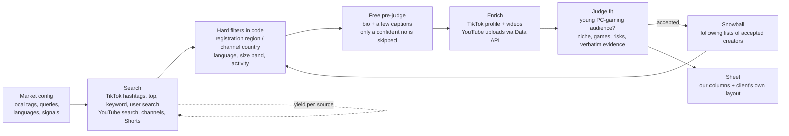

# Creator Scout

**Finds the small gaming and tech creators nobody else finds, country by country, on TikTok and YouTube, and hands a marketing team an outreach-ready sheet.**

> "The bottleneck isn't strategy or budget, it's discovery." — the challenge brief

Paid creator databases start at 1k or 10k followers and search in English. Small
markets like Estonia have a few hundred relevant creators with 2k–50k followers,
posting in Estonian or Russian. Creator Scout searches the way a local would,
filters on hard data, lets an AI judge fit from each creator's own posts, and
then follows who good creators follow. That's where most small-market creators
turn up.

**Live demo:** LIVE_URL (saved runs work for everyone; live runs need the access code)

## Results on real markets

| Market | Accounts reviewed | Accepted creators | Credits | Accepted per 100 credits |
|---|---|---|---|---|
| Finland | 3,039 | 63 | 650 | 9.7 |
| Estonia | 2,738 | 19 | 550 | 3.5 |
| Germany | DE_REVIEWED | DE_ACCEPTED | DE_CREDITS | DE_PER100 |

**Hold-out recall.** The client shared a list of creators they already work with.
We ran each market *without* the list, then checked how many of those
partners the tool found on its own:

- **Finland: 8 of 12** (6 found and accepted; 2 found but outside the default
  size band). Missed: one inactive for 4 months, one lifestyle creator, one
  entertainment channel, one Twitch-only streamer.
- **Estonia: 2 of 3**, both accepted. The third posts GTA content, and GTA
  wasn't one of our Estonian search sources. It is now.

Using the partners as seeds afterwards found 12 more new Finnish creators for
150 credits; the partners' following lists gave 9.9 accepted per 100 credits.

**Where creators come from** (accepted per 100 credits, Finland): YouTube
search in the local language 75, local gaming hashtags 10.8, snowballing
through following lists 6.4 (and 27 of the 63 creators). In Estonia, global
game hashtags through a local proxy returned 0–4% Estonian authors; in Germany
the same tags returned 22–56% German authors. So they are a last resort for
small markets and a main source for big ones.

**Cost.** About 10 credits per accepted creator in Finland and 29 in Estonia.
On ScrapeCreators' paid plans ($1–1.9 per 1,000 credits) that is roughly
1–5 cents per creator. The LLMs are free tiers.

## How it works



1. **Search like a local.** Each market has gaming hashtags and phrases in its
   own languages (Estonian and Russian for Estonia), YouTube queries in the
   local language with the region set, Shorts searches, and 40–60 more query
   variants generated by an LLM. Every source gets a couple of pages; after
   that the budget follows yield, so sources that find creators get more.
2. **Hard facts in code.** TikTok registration region (confirmed with a
   dedicated lookup when unclear) or YouTube channel country, language and
   local signals, follower/subscriber band with a soft cap (up to 1.5× is kept
   and flagged), private and inactive accounts. Nothing is thrown away:
   every account keeps its status and reason, and accounts from another market
   are queued for that market.
3. **Free pre-judge.** Before paying for more data, an LLM looks at what we
   already have (bio, a few captions). Only a confident "no" is skipped.
4. **Enrich.** TikTok profile and recent videos; YouTube uploads from the free
   official API, with long videos and Shorts measured separately. Average
   views over the last 30 days (90 if fewer than 3 videos), window and video
   count stated.
5. **Judge.** Would a young PC-gaming audience watch this creator? The judge
   returns niche, games, scores, risks and a **verbatim evidence quote**; code
   checks the quote exists and enforces the rubric's thresholds.
6. **Snowball.** Creators follow creators from their own country. As soon as
   two are accepted, their following lists are expanded between search pages.
7. **Sheet.** One row per creator (TikTok and YouTube merged when linked):
   country, followers/subscribers, average views with window, niche and games,
   contact, risks (competitor sponsorship, brand safety, inactivity), trend,
   evidence and "found via". Also exported in the client's own sheet layout.

Judging runs on free LLM tiers in parallel (Groq models plus OpenCode's
space-bunny), or on Claude in skill mode. On 60 real candidates the free chain
agreed with Claude's accept/not-accept decision 85% of the time.

## Run it locally

```bash
uv venv && uv pip install -e ".[dev]"
cp .env.example .env    # SC_KEY, YOUTUBE_API_KEY, GROQ_API_KEY, OPENCODE_API_KEY
scout markets
scout run --market ee --preset hidden-gems --budget 200
scout check && scout export
uvicorn web.app:app --port 8000   # the web app; SCOUT_ACCESS_CODE enables live runs
```

| Command | Purpose |
|---|---|
| `scout run --market ee --preset hidden-gems` | full run (`--judge claude` pauses for Claude to judge) |
| `scout resume --run N --budget B` | continue a run from its stored state |
| `scout yield --run N` | accepted creators per 100 credits, by source |
| `scout recall --market fi` | hold-out check against a private partner list |
| `scout export --run N` | XLSX (incl. the client's layout) and CSV |
| `scout check --run N` | quality gates a run must pass before it is reported |

Every API response is cached in `data/scout.db`, so reruns cost nothing, and
every run has a hard credit budget. Tests run offline on saved, anonymised API
responses: `pytest`.

**Claude skill.** `skill/creator-scout/` packages the workflow for Claude Code:
Claude pre-judges and judges with the rubric via `scout candidates` /
`scout decide`, and `scout check` must pass before it reports.

## Data and compliance

Only public, logged-out profile data is used, via a data provider
(ScrapeCreators) and the official YouTube Data API. Only fields needed for
outreach are kept. The tool drafts; a person decides and sends, and first
contact should say where the profile was found and offer an opt-out (GDPR
Art. 14). Platform terms restrict automated collection; a compliance review
is advisable before commercial scale. The public demo masks email addresses.

## Built with

Built during the hackathon with Claude Code (Claude Opus), which wrote the code
with the author; see `CHANGELOG.md`. Data: ScrapeCreators, YouTube Data API.
LLMs: Groq free tier, OpenCode Zen. MIT licence.
